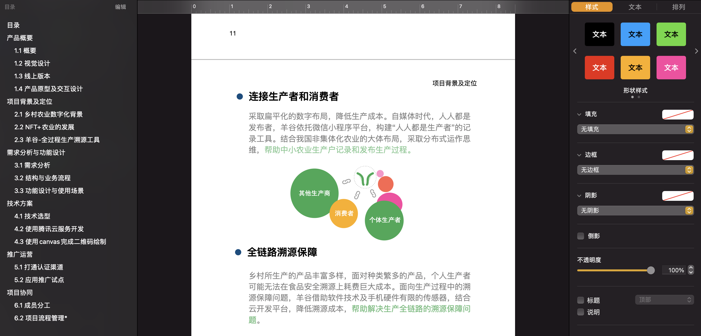
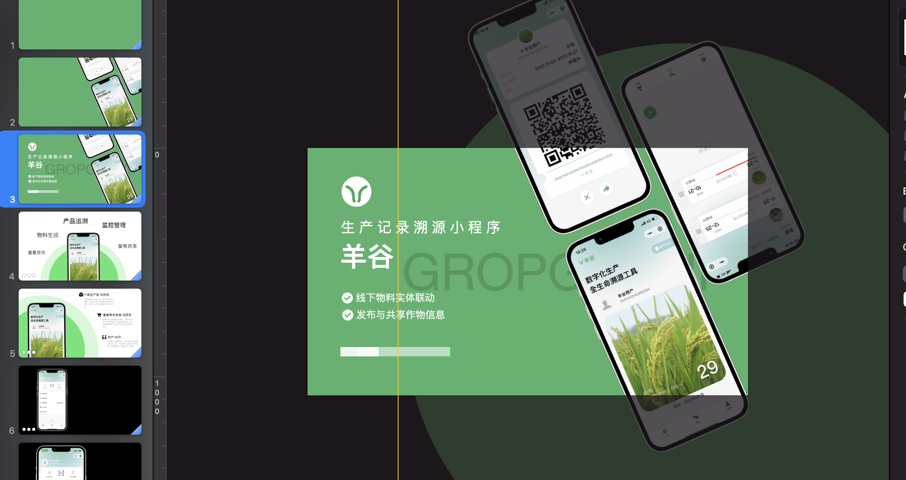
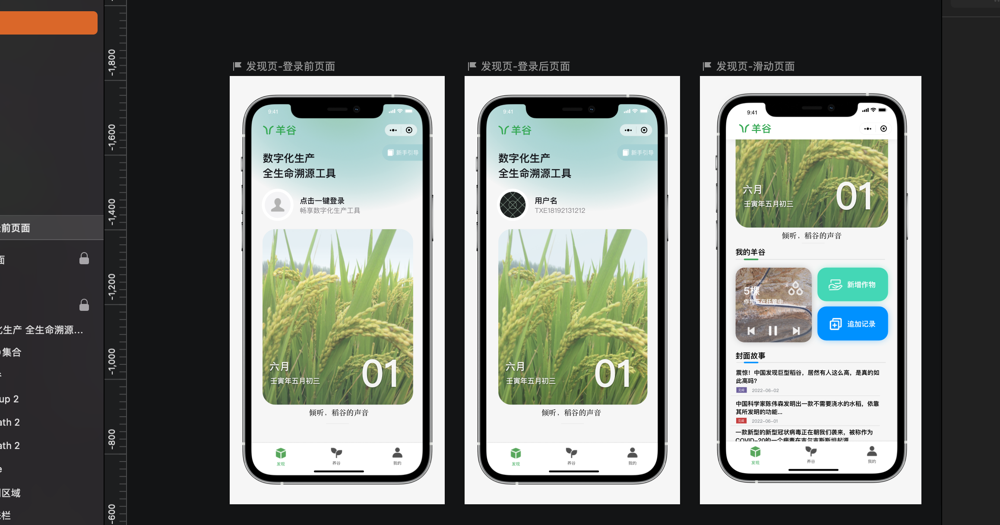
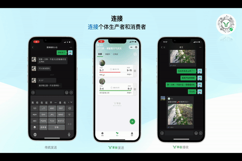
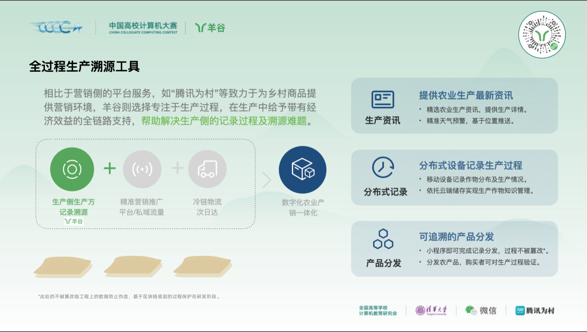
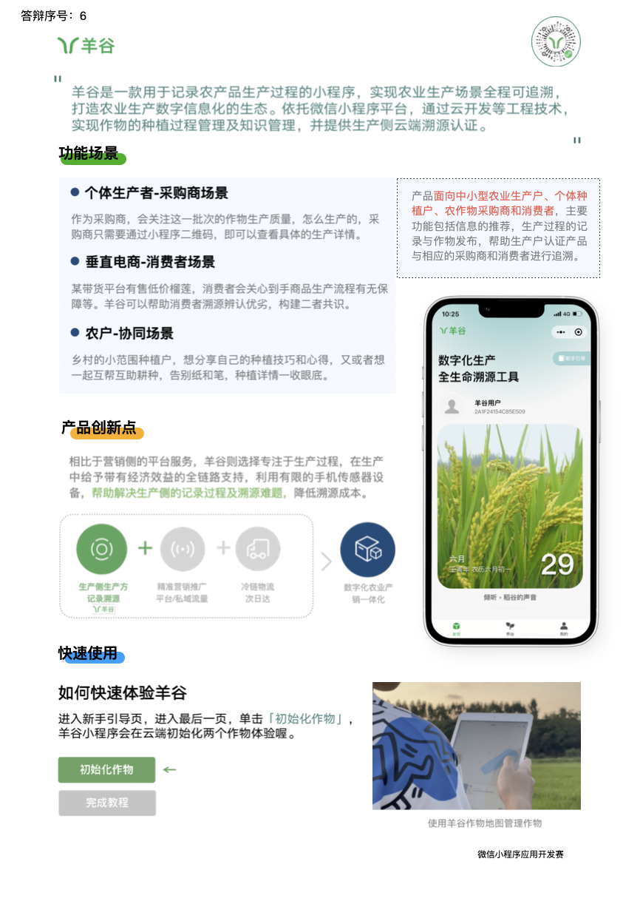

# 羊谷赛事经验仓库

> 为了可以使软件产品更好服务于人，开启此仓库。如果喜欢，请给一个star吧。

在这个仓库你你可以找到下面这些，但是因为是使用keynote进行制作，为了保证兼容性，下面的内容都会以pdf的形式贡献，欢迎大家批评指正。如果需要原稿，因为文件比较大，所以请给作者发个邮件取得。

- [我是怎么参加“PPT吹水大赛”的-2022微信小程序应用开发赛国一产品经验分享](https://github.com/Crop-Group/open-source/blob/main/%E4%BA%A7%E5%93%81%E7%BB%8F%E9%AA%8C.md)

## 初赛时期（关键）：

1. 参赛产品文档 - 使用ipages制作

不要堆word，需要在文档里展现项目的价值和解决的痛点问题，用可视手段表达出来。

2. 产品动画录制视频 - 使用keynote制作

因为当时没时间用C4D做3D，所以使用了ppt动画配合平滑，最后效果也挺好的。建议尽量跟我们一样，不要用模版。

3. 产品原型图 - 使用sketch制作

好的产品要有原型图，不然会找不着北。

## 华南赛区赛时期：

3. 答辩PPT 

这个因为后来修改过了找不着，以最终国赛时期的为准，大体上类似。因为pdf缺少动画，在这里稍微预览一下动画。

4. 上交给评委的PPT卡片

用于给评委了解全貌所使用的ppt卡片。

## 全国总决赛时期：

5. 答辩ppt

重头戏，但是因为太大了(200+M)迁移不过来，因此仓库里转成pdf，会缺一些动画效果，可自行下载。

6. 上交给评委的一页缩略稿

7. 羊谷故事纪录片（宣传片）

[https://www.bilibili.com/video/BV1oa411G7cP/?vd_source=b188e622c28e25298e5f7a9d2431b2e6](https://www.bilibili.com/video/BV1oa411G7cP/?vd_source=b188e622c28e25298e5f7a9d2431b2e6)

> 希望可以帮到更多学生软件产品，服务于人。 --- by favorhau 