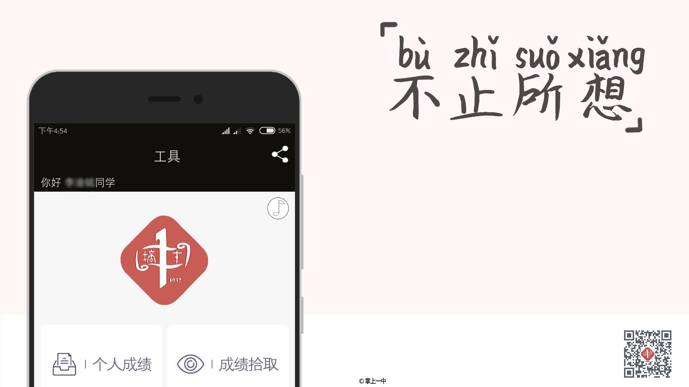
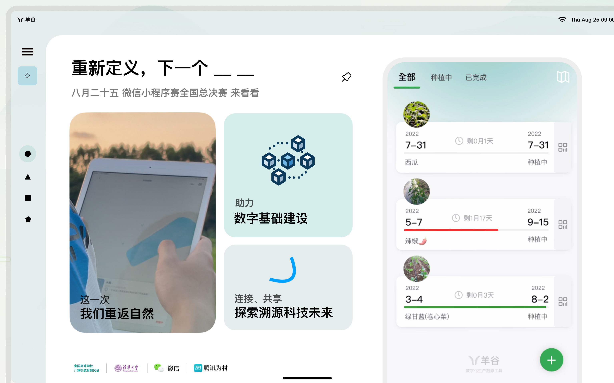
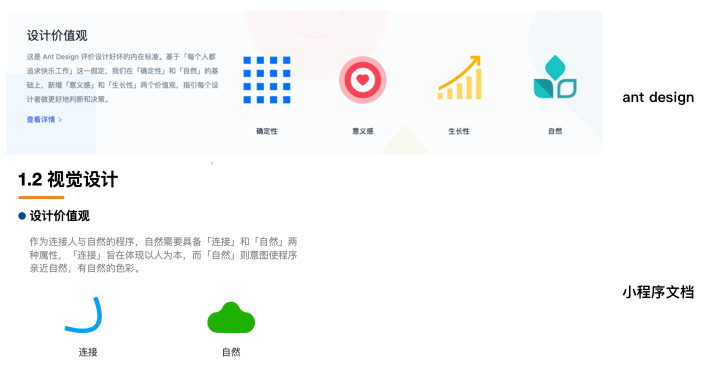
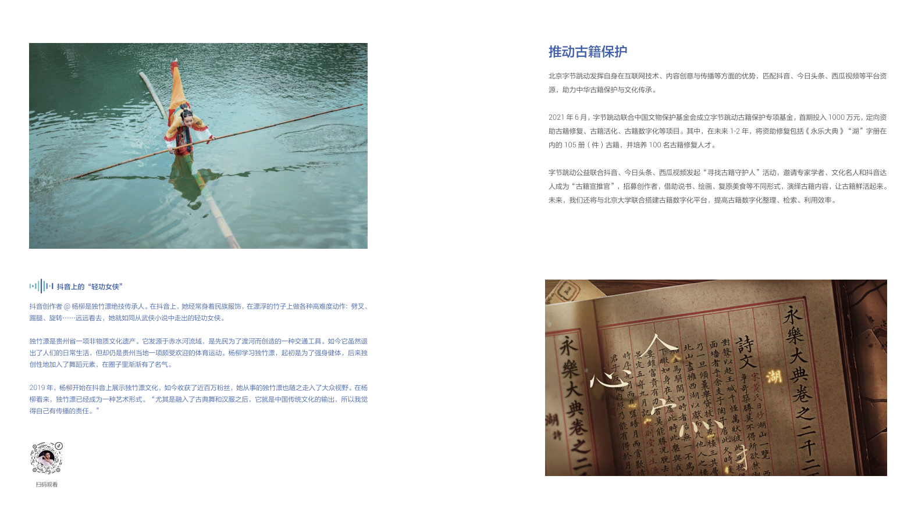
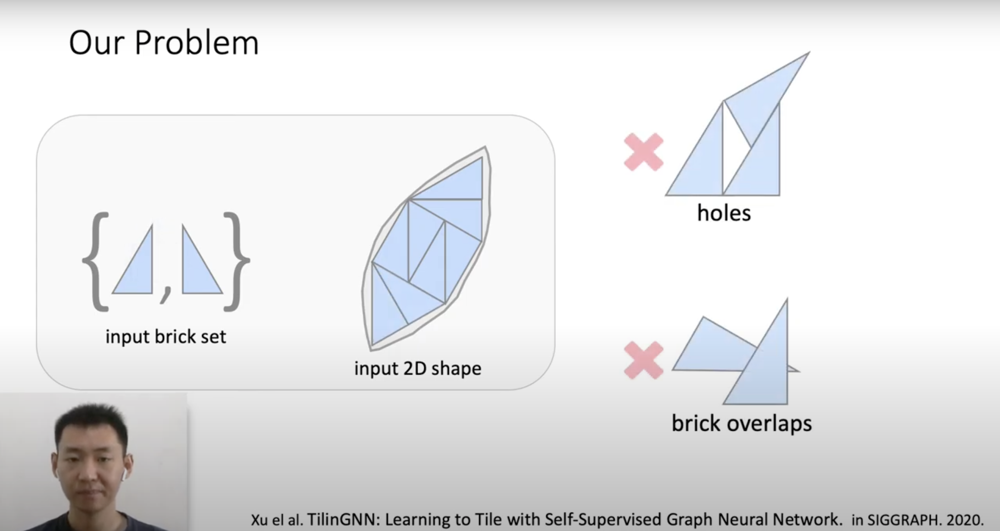
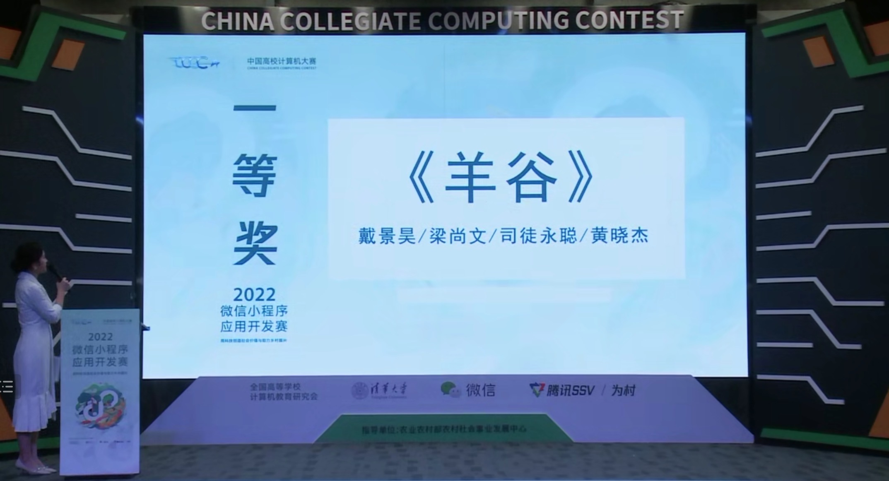

# 我是怎么参加“PPT吹水大赛”的-2022微信小程序应用开发赛国一产品经验分享

## 写在前面

> 在写这篇文章之前，笔者跟大多数人一样，在焦虑工作，焦虑考研。写下这些，也是对自己的总结，希望可以继续前行。文章底部我会开源所有的参赛资料，希望各位指正。

五年前，我是半个软件工程师，相比于其他优秀的工程师，我基础并不扎实（以至于在代码技术层面差了一截），反而是很喜欢给程序堆料，希望可以惠及更多人。于是就有了这个

    
    简约的产品海报

这是五年前我给自己程序做的海报，功能也十分简单。今天参加这个比赛，我也采用了相同的方式。有了一定的履历，或许自己的思考和表现力有了一些提升，PPT和文档写的可能好了一些。

    
    Material Design风格的海报

**下面的分享仅仅对于这里可能对处于学生阶段学技术，但又想要做一个产品的你有所帮助，如果是企业里的产品经理则是需要另一种思维方式，需要对业务场景更专业，这里各位请注意区分。这些经验仅针对作品类比赛（小程序赛、网络技术挑战赛、人工智能创新赛等）**。

## 做好调研 挖掘产品创新

调研是很关键的一步，不论是日后做学术相关的研究，还是从事其他创新性质工作，都需要进行调研。这里的调研，并不是搜索「某某教程视频讲解」，也不是简单的看看前一届的比赛作品。调研是需要有广度的（这种综合比赛甚至需要跨学科），也需要有深度（专注特定场景）。

小程序赛类似于小型的互联网+比赛，对于产品的定位和包装非常关键。我想这一类赛事，或许要么做别人没做过的（尽量做体系创新），做别人做过但没做好的（专注解决某个场景痛点），这次乡村振兴主题的比赛，我们的程序专注在于「探索数字化溯源」的命题上，同时使演示文稿和宣传片处于同一个风格上。原本「溯源」是个很严谨的东西，那我们怎么把他下放到一个简单「扁平化」的新场景中呢？

## 站在巨人的肩膀上

说到写文档，你们是不是第一个想到的是用word「分点作答」？产品文档并非是实验报告文档，而是深度浓缩的精华，在初赛的时候非常关键，因为初赛没有答辩。产品定位可以体会不同大厂传递出来的价值观，需要有自己产品的价值观，最好可以造出自己的IP。

    
    参考蚂蚁ant design打造设计价值观

所有的可视手段要围绕着产品定位，不可脱离设计价值观，比如说很多人喜欢下载一些“漂亮”商业模版，套在自己的ppt上，这样可能就违反了设计价值观。写文档的时候可以关注比如说腾讯云的产品文档，[字节跳动可持续报告](http://p3-bd-official.byteimg.com/obj/bytedance-cn/2021北京字节跳动企业社会责任报告.pdf)的撰写。而对于PPT，要基于模版，高于模版，可以关注苹果公司每年发布会的文稿视觉设计，那些朋友圈的「精美模版」实际上同质化程度很高，切忌模版。同时，PPT是需要跟演讲者联动起来的，不可割离，条件允许可以注意细节。

    
    字节跳动企业社会责任报告（节选）

产品原型不可缺少，需要有自己的UI风格。同时可以在答辩的时候拍产品的微电影，在答辩的时候可以让评委看到更多价值，省赛的时候我回去乡村取景剪辑，最后答辩也有了很好的效果。这里的视频不只可以局限于功能本身，更多的是与人文的勾连，这里推荐去看看陈可辛导演的《三分钟》以及腾讯为村实验室做的视频。
而在答辩演讲方面，我很喜欢TED Talks 以故事的引入方式。对于原型设计，可以参考谷歌的material design风格和最新的Material You标准。

其实每一个方向都有很深的研讨方向，并非简单的「PPT吹水」。站在这些巨人的肩膀上，多关注国内外优秀的作品，在他们的基础上创新，不可闭门造车，可以有新的体会。

## 提高技术价值
什么是技术创新？我想每个人定义不同。在笔者这里，将一个环境的技术，迁移到另一个环境去使用，或者提升精准度、优化精度都可以算技术创新。
创新的技术跟产品是相互促进的，比如21年的第一名港中文的博士在小程序里嵌入了3d模型，今年北大的一位同学做了艺术元宇宙，做到了技术上的创新，这对产品的发展是有益的。

    
    21年小程序赛第一名技术人员的学术分享会

## 使用专业的工具

对于所使用的工具，推荐使用Mac全家桶（keynote演示,ipages文档），ps或许是人均水平，最好会Adobe Illustrator和C4D，以及原型设计的sketch。熟练使用工具可以把自己的想法表现出来，使产品更具有生命力。当然，工具只是一种实现方式，本质上都可以产出。比如说用Vim也可以写代码，笔者就挺喜欢vim。

## 体会程序与人文的高度统一

最后，容许我写一句抽象的话，程序最终需要服务于人，往往是人文与哲学的高度融合，海外的团队这一方面做的非常好，也是我等所不能及的。在我们眼里或许程序是简单的业务，但在某些人眼里，程序是一段故事，是人文与情怀。

> 以上或许都是侃侃而谈，每一个细节都可以仔细研究。诚然，对于一名优秀的产品经理而言，这些还远远不够，用于应对此类的作品类竞赛或许很适用。

最后挂一下我们拿到一等奖的时刻。

    
    希望未来我们还能如此幸运

## 参考

1. 字节跳动社会可持续报告

http://p3-bd-official.byteimg.com/obj/bytedance-cn/2021北京字节跳动企业社会责任报告.pdf

2. Google-Material You规范

https://material.io/blog/announcing-material-you

3. 方仔照相馆(Decamp 2020 champion project)

https://www.youtube.com/watch?v=Sfxbe84bYck

4. 张小龙：微信十年的产品思考

https://finance.sina.com.cn/tech/2021-01-19/doc-ikftpnnx9427864.shtml

